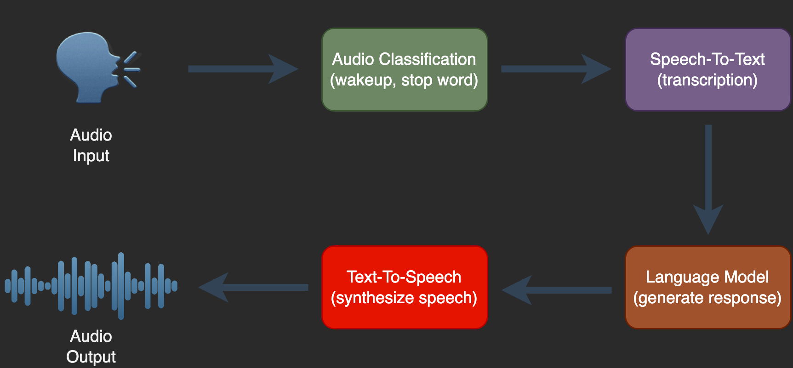

# Voice Assistant

After looking at the various pre-trained models on HuggingFace, I wanted to put some of them together to create a slightly more interesting solution.
The result is an assistant that you can talk to, just like “Hey Google” or “Amazon Alexa”.

Basically, it is a concatenation of four components.
The first component is a trigger that listens for the word “stop” and “sheila”.
While “stop” ends the application, “sheila” activates the transcription with the second component.
This converts what is subsequently spoken into text.
This text is fed into the third component, the LLM.
This generates a response in text form.
The fourth component synthesizes this text back into audio.



I built the whole thing relatively quickly and as a kind of MVP, so bugs are not excluded.
Nevertheless, if anyone wants to try it out, take a look at the setup.

## Setup
```
# Create a environment
python -m venv env

# Activate the env
source venv/bin/activate

# Install the requirements
pip install -r requirements.txt

# Install Natural Language Toolkit packages
python install.py

# Run the demo
# On the first start, all required models will be downloaded which will take ~16GB.
python main.py
```